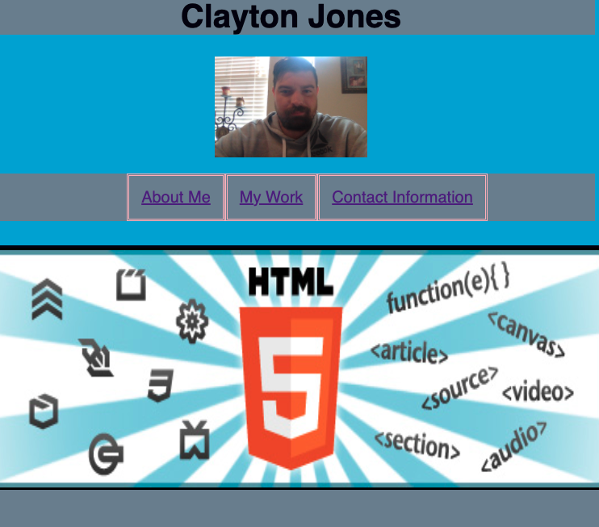

# CGJ_Portfolio

Introduction: This project is to showcase my newly developed skills in HTML and CSS. It is a first attempt at creating the portfoilio that will at the end of this course be filled with work so that I can impress an employer. 

Technologies used:
    o HTML
    o CSS

Launch:
https://cgjones0711.github.io/CGJ_Portfolio/
https://github.com/cgjones0711/CGJ_Portfolio.git
Snap shots:
    
    
    